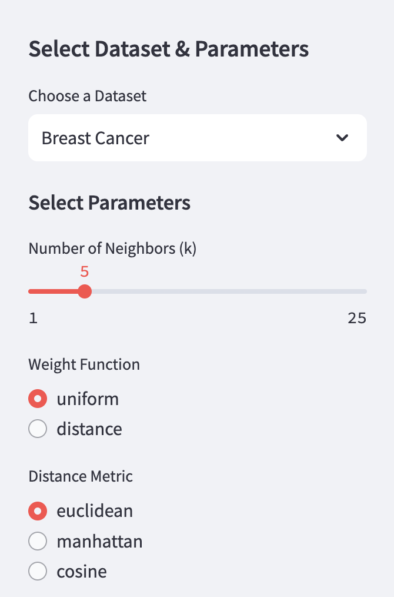
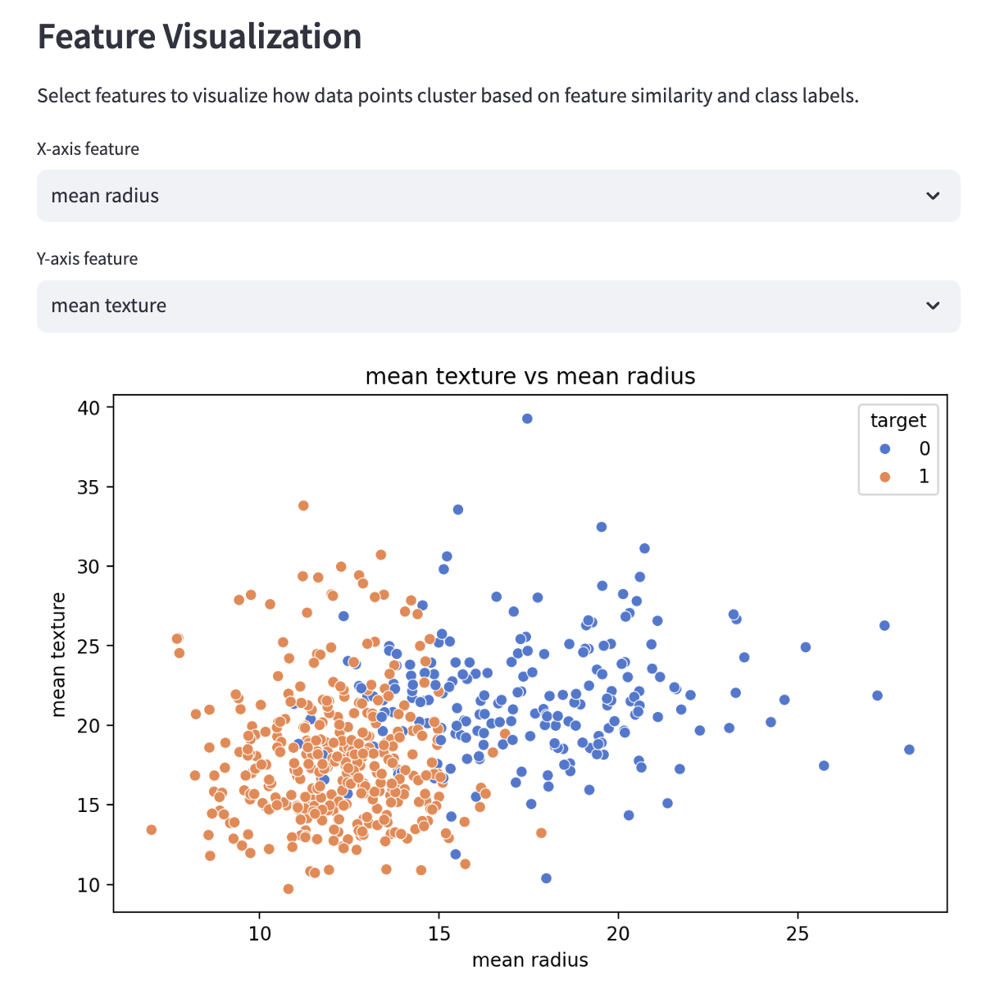
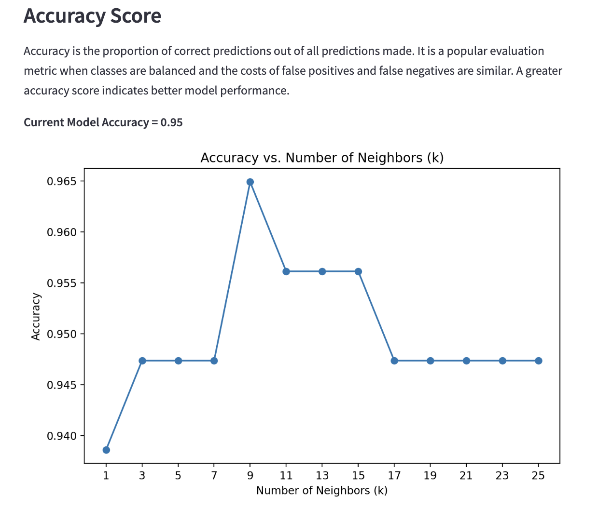
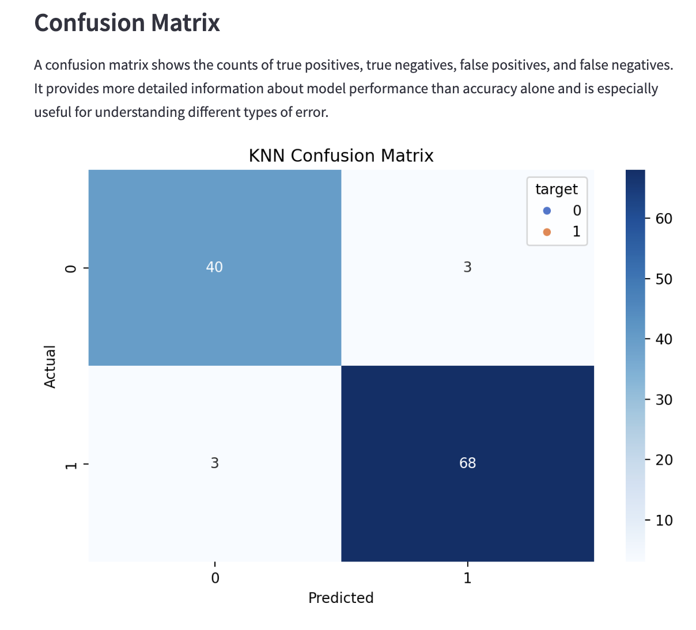
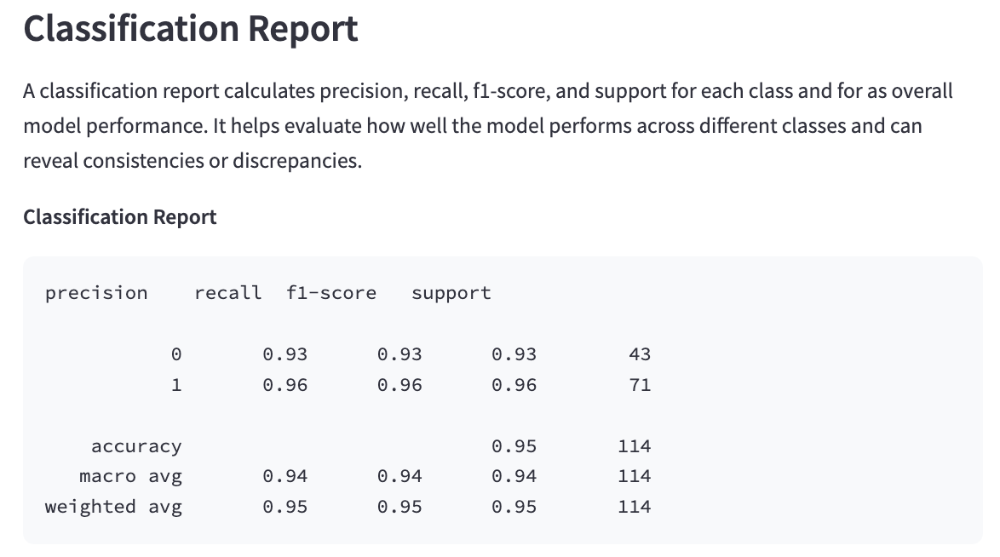

# Data Science Project #3: Machine Learning Application Project

## Project Overview: K-Nearest Neighbors Machine Learning Explorer
The goal of this project is to create an interactive Streamlit application that allows users to explore K-Nearest Neighbors (KNN) machine learning. Users can experiment with model parameters and visualize how their choices impact classification performance on a dataset of their choosing.

## App Features
**1. Model & Parameters**
- This app incorporates a **K-Nearest Neighbors (KNN)** machine learning model, which classifies unseen data points based on the measured proximity of their nearest neighbors in the feature space.
- Users have the ability to **adjust KNN parameters** and observe how each choice influences model performance.
  - **Number of Neighbors (k):** Users can adjust 'k' values to control the number of neighboring data points considered
  - **Weight Function:** Users can choose between 'uniform' (neighbors have equal weight) or 'distance' (closer neighbors have more influence)
  - **Distance Metric:** Users can select 'euclidean' (straight line), 'manhattan' (grid-like), and 'cosine' (vector angle) calculations
 
<p align="center">
  
</p>

**2. Feature Visualization**
- The app incorporates an interactive scatter plot, allowing users to select any two features from the dataset to visualize how similar features can produce similar classes.
- Although the scatter plot only displays two dimensions, this visualization strategy primes users to observe patterns similarly to KNN.

<p align="center">
  
</p>

**3. Live Model Evaluation**
Performance measures are calculated and displayed in real time based on dataset and parameter selection:
- **Accuracy Score:** Calculates the overall percentage of correct predictions and depicts a plot of accuracy by number of neighbors for the specific model.
- **Confusion Matrix:** Creates a heatmap to show true positives, true negatives, false positives, and false negatives. This allows users to consider different error types.
- **Classification Report:** Displays precision, recall, and f1-scores for each outcome and for the overall model.
<p align="center">
    
</p>

## Instructions
**Run the App Locally:** Follow these steps in your terminal

1. Clone the repository
   ```
   git clone https://github.com/qfshannon/Shannon-Data-Science-Portfolio.git
   ```
2. Navigate to the app directory
   ```
   cd Shannon-Data-Science-Portfolio/MLStreamlitApp
   ```
3. Install requirements
   ```
   pip install -r requirements.txt
   ```
4. Run the app
   ```
   streamlit run main.py
   ```

**Deployed Version**: Access the app through [Streamlit Cloud](https://shannon-data-science-portfolio-4bkspxqqw8jifhvbcpwwsk.streamlit.app/)


## References
- [Scikit-learn K-NeighborsClassifier Documentation](https://scikit-learn.org/stable/modules/generated/sklearn.neighbors.KNeighborsClassifier.html)
- [Streamlit Documentation](https://docs.streamlit.io/)
- [Pandas API Reference](https://pandas.pydata.org/docs/reference/index.html#api)
