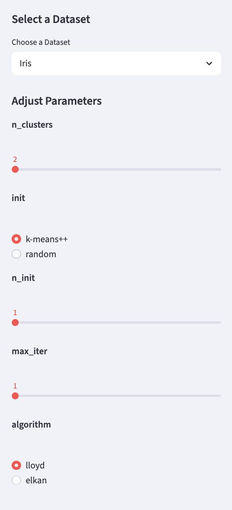

# Data Science Project #4: Unupervised Machine Learning Application Project

## Project Overview: K-Means Clustering Machine Learning Explorer
The goal of this project is to create an interactive Streamlit application that allows users to explore K-Means Clustering machine learning. Users can experiment with model parameters and visualize how their choices impact clustering performance on a dataset of their choosing.

## App Features
**1. Model & Parameters**
- This app incorporates a **K-Means Clustering** machine learning model, which forms clusters of data points based on the measured proximity of their nearest neighbors in the feature space. By forming clusters, K-Means Clustering can **identify structure**, **group observations**, or **uncover hidden patterns** in unlabeled data
- Users have the ability to **adjust model parameters** and observe how each choice influences model performance.
  - **Number of Clusters (k):** Users can adjust 'k' values to control the number of initial centroids used.
  - **Initialization Method:** Users can choose between 'k-means++' (selects initial cluster centroids using sampling) or 'random' (chooses observations at random to form initial centroids).
  - **Number of Initializations:** Users can adjust the number of times the k-means algorithm will be run with different centroid seeds.
  - **Maximum Iterations:** Users can set the maximum number of iterations of the k-means algorithm for a single run.
  - **Algorithm:** Users can select the 'lloyd' (iteratively assigns points to the nearest cluster centroid and then updates the centroids based on the mean) or 'elkan' (uses triangle inequality to reduce the number of distance calculations) algorithm used to compute k-means clustering.

  

