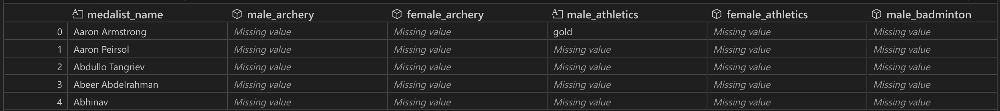
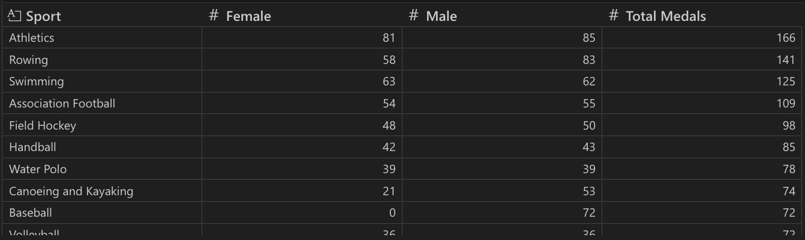
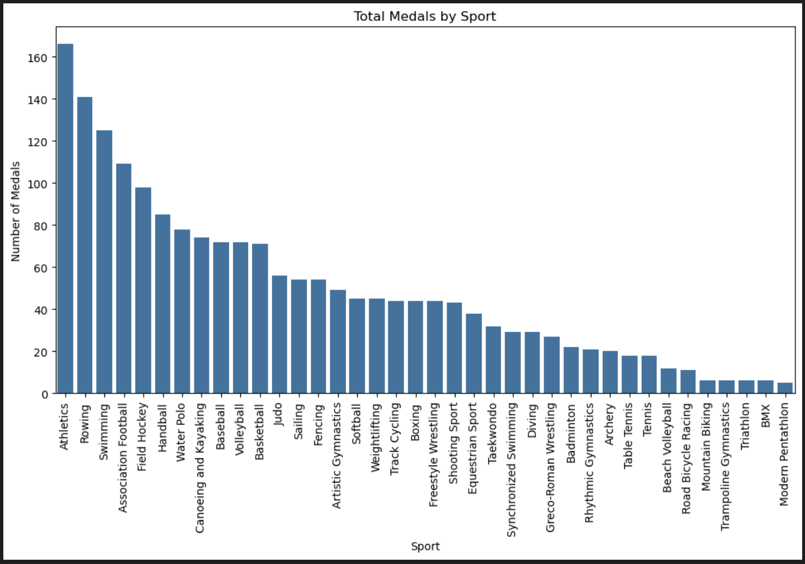
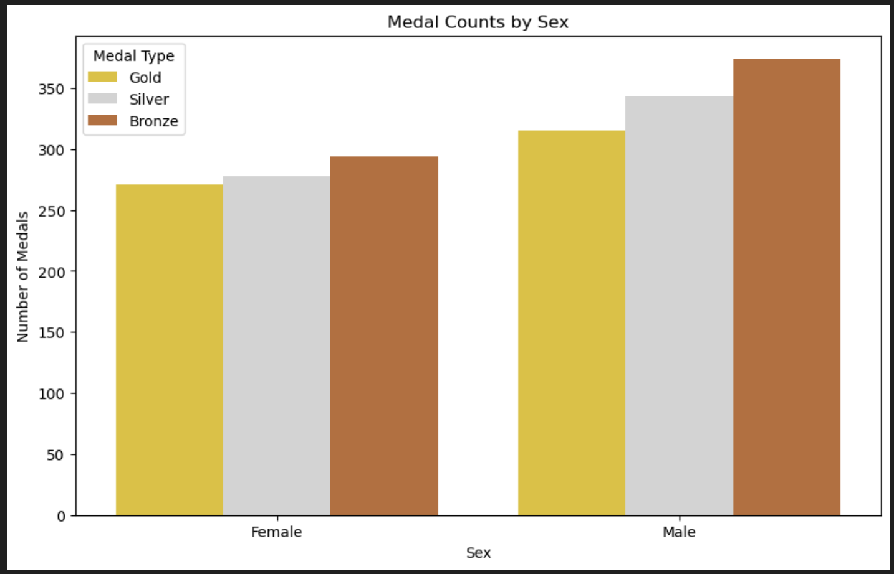

# Data Science Project #2: Data Cleaning & Tidy Data
Goal: Create a project that applies the principles of tidy data using Python. Develop a Jupyter Notebook that cleans and visualizes data using a 2008 Olympic Medalists dataset.

## 2008 Olympic Medalists Tidy Data Project
Objective: transform a dataset containing information on 2008 Olympic medalists so that...
- Each variable is in its own column.
- Each observation forms its own row.
- Each type of observational unit forms its own table.

## Instructions
To run this notebook:
1. [Download zip of Shannon-Data-Science-Portfolio](https://github.com/qfshannon/Shannon-Data-Science-Portfolio/archive/refs/heads/main.zip) and open in coding environment (VS Code)
2. Open TidyData-Project
3. Open main.ipynb
4. Run code to view outputs.

## Dataset Description
[This dataset](data/olympics_08_medalists.csv) was modified from data on the [2008 Summer Olympics](https://edjnet.github.io/OlympicsGoNUTS/2008/). Before initiating the data tidying process, data was preprocessed to standardize capitalization and spacing conventions. Original features included medalist name and each sex-sport combination. The associated observations consisted of name and medal type earned.

After data cleaning and tidying, each variable was represented by its own column, and each observation by its own row. Processed features included 'Medalist Name', 'Sex', 'Sport', and 'Medal', upholding the aforementioned principles of tidy data.
- Original Dataset:

- Tidy Dataset:

## Explore References to Learn More
- [Pandas Cheat Sheet](https://pandas.pydata.org/Pandas_Cheat_Sheet.pdf)
- [Tidy Data Principles](https://vita.had.co.nz/papers/tidy-data.pdf)

## Visual Examples
Visualization 1: 

Visualization 2:

Pivot Table:

