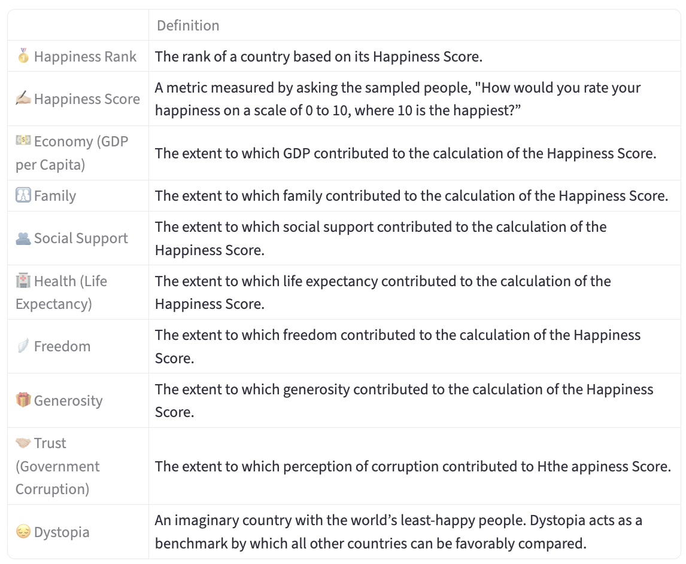
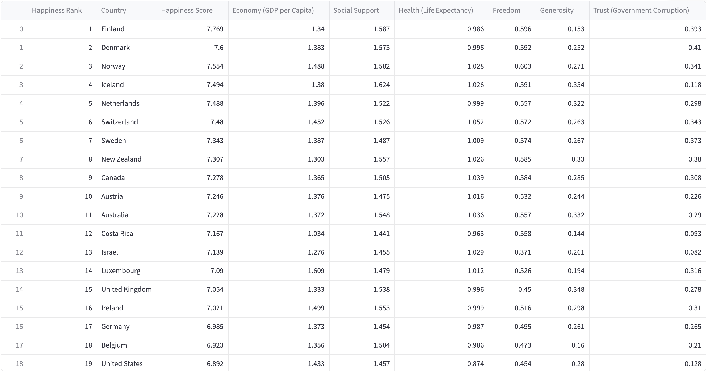
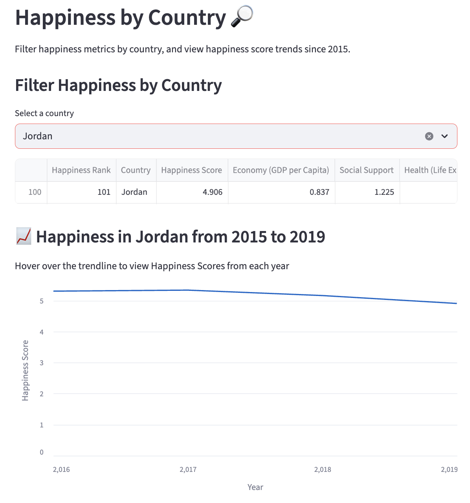
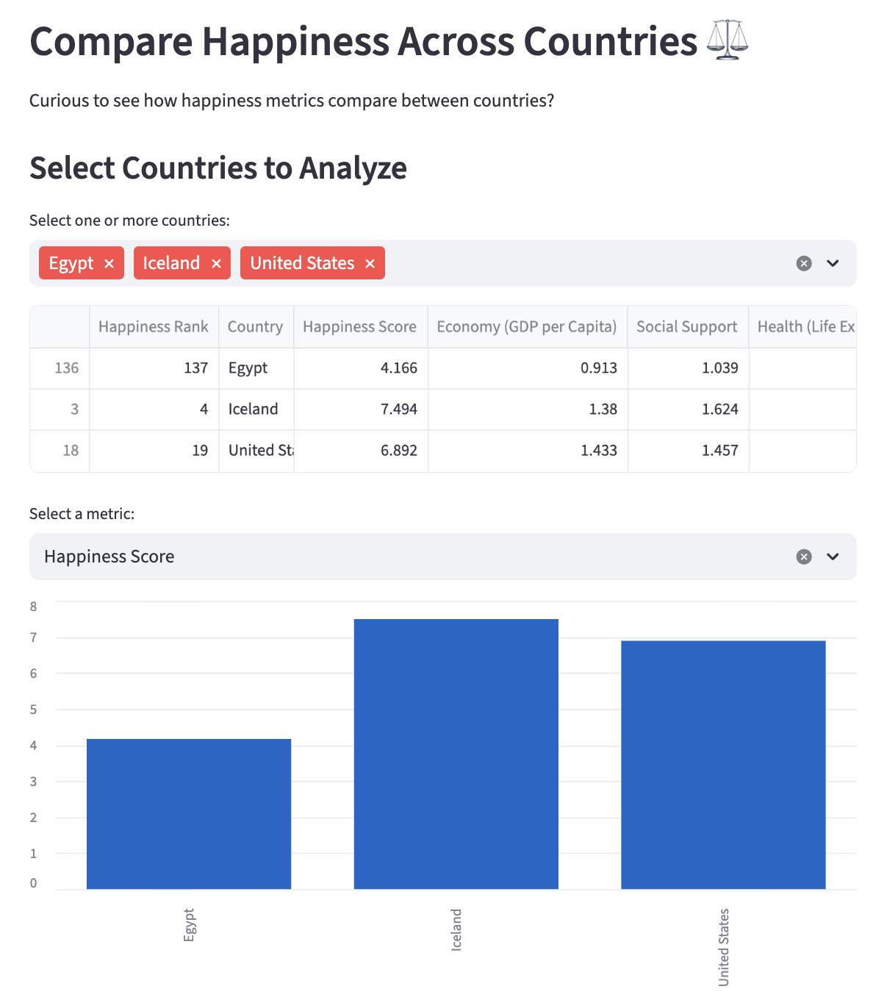

# Data Science Project #1: Present Data with Streamlit
Goal: Design a basic Streamlit application to display data interactively.

## World Happiness Explorer App
For this project, I chose to build a Streamlit app to present data from the **2019 World Happiness Report**. This user-friendly app presents an overview of the data and offers features to examine and compare happiness measures of selected countries.

This project demonstrates my progress in python and data communication.

### About the Data
**Features:**

  
  

**Example Visualizations:**

This app offers a variety of interactive features that allow users to personally engage with and explore the data. Users can examine happiness trends over time for a selected country, or compare multiple countries based on a chosen metric.

  
  

## Instructions to Run the App
**To Open With Code:**
1. [Download zip of Shannon-Data-Science-Portfolio](https://github.com/qfshannon/Shannon-Data-Science-Portfolio/archive/refs/heads/main.zip) and open in coding environment (VS Code)
2. Open the terminal and install streamlit: pip install streamlit
3. Run from basic_streamlit_app folder: cd basic_streamlit_app
4. Run the Streamlit app using: streamlit run main.py
